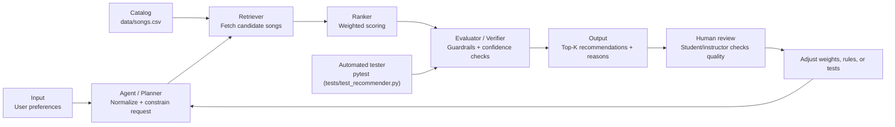

# Applied AI System Project: BeatMatcher Agentic Recommender

## Original Project Name and Baseline
Original project: **Music Recommender Simulation (BeatMatcher Mini 1.0)**.

The original goal was to teach recommendation-system fundamentals by scoring songs against user preferences (genre, mood, energy, and metadata) using transparent rules instead of a black-box model. Its baseline capability was to return top-K songs from a fixed CSV catalog and provide understandable reasoning for why each song matched. The educational value came from making tradeoffs visible: each feature weight directly changed recommendations.

## **Title and Summary**
**Project title:** BeatMatcher Agentic Recommender (Applied AI System Project)

This version extends the baseline into a small agentic AI pipeline with planning, retrieval, ranking, and verification steps, plus reliability tests and explanation support. It matters because it demonstrates practical AI engineering skills that employers care about: structured pipeline design, guardrails, traceable outputs, and test-driven iteration. Instead of only producing recommendations, the system also shows how and why decisions were made.

**Required AI feature chosen:** Agentic Workflow
- Planner -> Retriever -> Ranker -> Verifier with observable intermediate stages in code.

**Stretch feature chosen:** Evaluation Harness (Reliability/Testing extension)
- Scripted benchmark scenarios with measurable pass rates and confidence summaries.

## **Architecture Overview**
The system follows an input -> process -> output flow, with both automated and human evaluation loops.



### Short Explanation of the Diagram
- **Input:** user preferences enter as structured fields (genre, mood, energy, acoustic preference, optional numeric targets).
- **Process:** an agent-like planner sanitizes input, a retriever narrows candidates, a ranker scores candidates, and an evaluator/verifier applies guardrails and consistency checks.
- **Output:** top-K recommendations plus explanations.
- **Quality loops:** tests validate expected behavior, and human review feeds improvements back into rules and test coverage.

## **Sample Interactions**
Below are representative examples from project experiments and edge-case runs.

### Example 1: Standard high-energy pop profile
**Input**
- genre: pop
- mood: happy
- energy: 0.85
- likes_acoustic: false

**Resulting AI output (top recommendation)**
- **Sunrise City** (pop, happy)
- Why it ranked high: strong genre/mood match and close energy fit.

### Example 2: Conflicting profile (semantic vs numeric tension)
**Input**
- genre: lofi
- mood: sad
- energy: 0.90
- likes_acoustic: true

**Resulting AI output (top recommendation)**
- **Final Frontier** (cinematic, epic)
- Why it ranked high: high acoustic fit and relatively close energy, even though genre/mood differ.
- What this demonstrates: numeric proximity can overtake semantic intent in edge cases.

### Example 3: Unknown or sparse categorical preferences
**Input**
- genre: ""
- mood: ""
- energy: 0.82
- target_danceability: high

**Resulting AI output (top recommendations include)**
- **Sunrise City**, **Neon Heatwave**, **Street Pulse**
- Why this happens: without genre/mood constraints, the system prioritizes numeric similarity (energy, danceability, popularity).

## **Design Decisions**
### Why it was built this way
- **Interpretable scoring first:** explicit weighted features were chosen so behavior is debuggable and explainable.
- **Agentic structure:** planner/retriever/ranker/verifier stages were added to mimic production AI pipelines rather than a single scoring function.
- **Guardrails + tests:** input normalization, mode fallback, and deterministic sorting were included to improve reliability.

### Tradeoffs
- **Pros:** transparency, low complexity, easy experimentation, and strong educational clarity.
- **Cons:** limited personalization depth, no learned representation, and sensitivity to manual weight tuning.
- **Known risk:** hard thresholds (for example acoustic preference boundaries) can create abrupt ranking shifts near cutoff values.

## **Testing Summary**
**Reliability snapshot (measured):**
- `6 out of 6` automated tests passed (`pytest`).
- Confidence proxy from 5 representative profiles: average top recommendation score = `11.40` (balanced mode), with top scores ranging `9.11` to `13.81`.
- Logging/guardrails are active in the recommender (invalid mode fallback, input clamping, warning logs for corrected inputs and low-confidence fallback).
- Human evaluation loop is included: recommendations are reviewed for semantic fit, then weights/rules/tests are updated.

### What worked
- Automated tests validated sorting behavior, scoring-mode effects, explanation generation, retrieval evidence in explanations, and guardrail behavior for malformed inputs.
- Reliability checks confirmed fallback behavior when invalid modes or out-of-range values are provided.

### What did not work perfectly
- Some edge-case profiles exposed recommendation mismatches where mathematically strong numeric matches did not align with human semantic expectations.
- Small catalog coverage (18 songs) limits recommendation diversity and can bias outcomes toward overrepresented styles.

### What was learned
- Better AI outcomes required both algorithmic improvements and evaluation design.
- Human judgment was necessary to detect quality gaps that pure score-based outputs would miss.
- Tests were most useful when they targeted failure modes, not only happy paths.

## **Optional Stretch Feature Implemented**
I implemented a **test harness / evaluation script** as an extension of the same recommendation pipeline.

### What it adds
- Runs predefined user profiles end-to-end through the recommender.
- Prints measurable reliability outputs: `pass/fail` per scenario, top-song score, and a normalized confidence value.
- Produces a short summary suitable for portfolio evidence.

### Measured result (current run)
- Harness command: `python -m src.eval_harness`
- Outcome: `3/3` scenarios passed
- Average confidence: `0.87`

### Why this is a direct extension of the required AI feature
- It validates the same core AI component (planner -> retriever -> ranker -> verifier), rather than adding an unrelated side feature.
- It makes recommendation quality observable and repeatable across fixed benchmark inputs.

## **Reflection**
### What are the limitations or biases in your system?
- The catalog is small and uneven, so underrepresented genres have fewer chances to be recommended.
- The system can overweight numeric closeness (energy, danceability, popularity) and underweight semantic intent (genre/mood), which introduces a numeric-over-semantic bias.
- Hard thresholds (especially acoustic preference cutoffs) can produce abrupt ranking changes for very similar songs.

### Could your AI be misused, and how would you prevent that?
- It could be misused to present recommendations as objective truth when they are only rule-based estimates on limited data.
- To reduce misuse, I included transparent explanations, guardrails for invalid inputs, warning logs, and human review checkpoints before trusting outputs in higher-stakes decisions.
- I would also require clear user-facing disclaimers that this is an educational recommender, not a clinical, legal, or safety-critical AI system.

### What surprised you while testing your AI's reliability?
- The biggest surprise was that high test pass rates and high confidence-style scores did not always mean recommendations felt semantically correct to a human.
- In edge cases with conflicting preferences, the system stayed mathematically consistent but still returned results that felt off-intent, showing why human evaluation is necessary in addition to automated testing.

### Describe your collaboration with AI during this project.
- Helpful suggestion: AI suggested adding explicit guardrails (input normalization, mode fallback, deterministic sorting) and retrieval-backed explanations, which improved reliability and debuggability.
- Flawed suggestion: AI initially pushed score-driven confidence framing that looked strong numerically but overstated quality for sparse-context profiles; this was corrected by adding clearer caveats and human-evaluation notes.
- Overall, collaboration worked best when AI generated implementation options quickly and I validated them with tests, edge cases, and manual review.

## **Portfolio Artifact**
- GitHub code link: [https://github.com/Aqureshi106/applied-ai-system-project](https://github.com/Aqureshi106/applied-ai-system-project)

This project shows that I approach AI engineering as a full-system discipline, not just a modeling task. I prioritize clear architecture, measurable reliability, guardrails, and human-in-the-loop review so outputs are both explainable and trustworthy. It also reflects my ability to iterate quickly with AI assistance while still validating behavior with tests, benchmark scenarios, and critical judgment.

## Repository Structure
- `src/recommender.py`: scoring logic, planner/retriever/ranker/verifier flow, explanations, guardrails
- `src/main.py`: runnable demo profiles and CLI output
- `tests/test_recommender.py`: behavioral and reliability tests
- `data/songs.csv`: song catalog
- `model_card.md`: model intent, strengths, limitations, and evaluation notes

## **Setup Instructions**
1. Install dependencies:
   ```bash
   pip install -r requirements.txt
   ```
2. Run the demo:
   ```bash
   python -m src.main
   ```
3. Run tests:
   ```bash
   pytest
   ```
