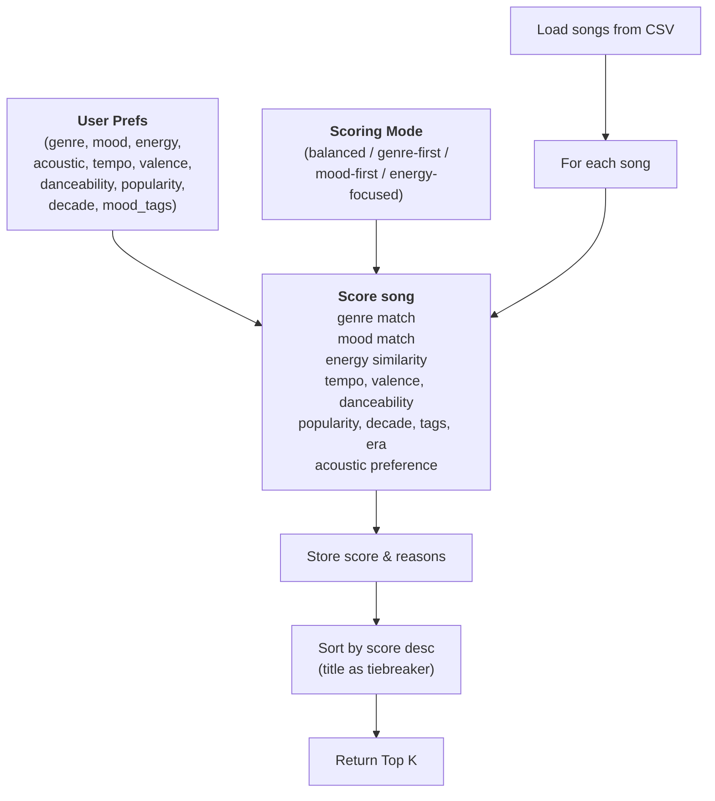
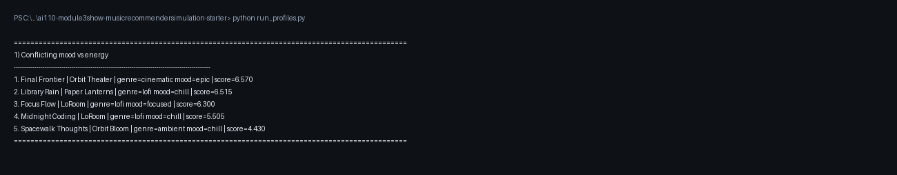
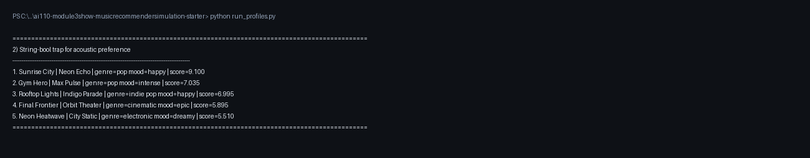
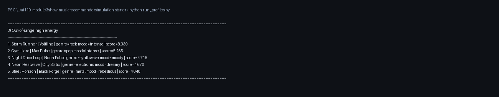
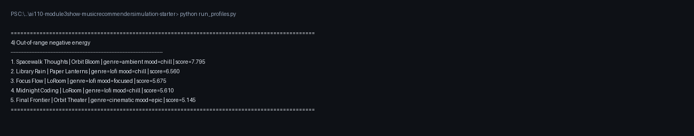
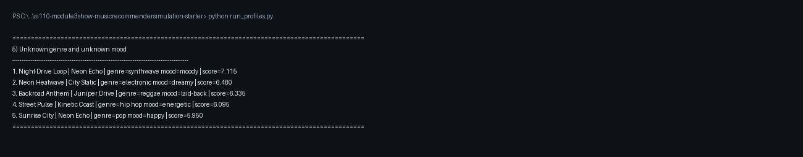
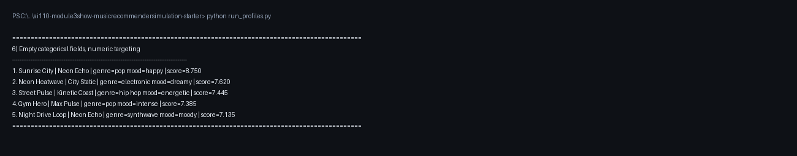
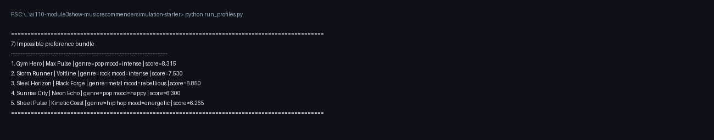

# 🎵 Music Recommender Simulation

## Project Summary

In this project you will build and explain a small music recommender system.

Your goal is to:

- Represent songs and a user "taste profile" as data
- Design a scoring rule that turns that data into recommendations
- Evaluate what your system gets right and wrong
- Reflect on how this mirrors real world AI recommenders

This version scores each song across 11 weighted features — genre, mood, energy, tempo, valence, danceability, popularity, release decade, mood tags, era descriptor, and acoustic preference — and returns the top K matches. Four scoring modes (balanced, genre-first, mood-first, energy-focused) let the caller shift emphasis depending on what matters most for a given user profile.

---

## How The System Works

Real recommendation systems combine many signals to predict what feels like a good next option. In this project, each `Song` carries genre, mood, energy, tempo, valence, danceability, acousticness, popularity, release decade, mood tags, and an era descriptor. The `UserProfile` stores a favorite genre, favorite mood, target energy level, acoustic preference, and optional numeric targets for tempo, valence, danceability, popularity, preferred decade, and mood tags.

The `Recommender` scores each song across all 11 features using a weighted formula. Categorical matches (genre, mood) add a flat bonus scaled by the active mode’s weight. Numeric features (energy, tempo, valence, danceability, popularity) add proximity points that decrease as the gap grows. Decade, mood tags, era descriptor, and acoustic preference add further bonuses when the song fits the listener’s era and vibe. A scoring mode — `balanced`, `genre-first`, `mood-first`, or `energy-focused` — multiplies each feature’s contribution so the caller can shift emphasis. Songs are then sorted by total score, with title as a tiebreaker, and the top K are returned.

### Algorithm Recipe

1. Load the songs from `data/songs.csv`.
2. Select a scoring mode (`balanced`, `genre-first`, `mood-first`, or `energy-focused`) which sets a weight multiplier for each feature.
3. Compare each song to the user's preferences one song at a time:
   - Add `1.0 × genre_weight` when the song's genre matches the user's favorite genre.
   - Add `1.0 × mood_weight` when the song's mood matches the user's favorite mood.
   - Add up to `6.0 × energy_weight` proximity points based on how close the song's energy is to the user's target.
   - Add up to `1.5 × tempo_weight` proximity points based on tempo closeness.
   - Add up to `1.25 × valence_weight` proximity points based on valence closeness.
   - Add up to `1.0 × danceability_weight` proximity points based on danceability closeness.
   - Add up to `1.3 × popularity_weight` proximity points based on popularity closeness.
   - Add up to `1.4 × decade_weight` bonus points when the song's release era matches the user's preferred decade.
   - Add up to `1.8 × tags_weight` bonus points for shared mood tags.
   - Add `0.9 × era_weight` when the song's era descriptor matches the inferred target era.
   - Add up to `2.0 × acoustic_weight` bonus based on whether the song's acousticness matches the user's acoustic preference.
4. Store each song's total score and the list of reasons that contributed to it.
5. Sort all songs by total score from highest to lowest, using title alphabetically as a tiebreaker.
6. Return the top K songs as the final recommendations.

### Potential Biases

This system might over-prioritize genre and energy, causing it to miss great songs that match the user's mood or overall vibe in a less direct way. Because the dataset is small and fixed, it can also reflect the limits of the catalog instead of the full range of real musical taste.

### Data Flow



---

## Getting Started

### Setup

1. Create a virtual environment (optional but recommended):

   ```bash
   python -m venv .venv
   source .venv/bin/activate      # Mac or Linux
   .venv\Scripts\activate         # Windows

2. Install dependencies

```bash
pip install -r requirements.txt
```

3. Run the app:

```bash
python -m src.main
```

### Terminal Output Screenshots

The screenshots below show top-5 terminal recommendations for adversarial and edge-case profiles used to stress-test the scoring logic.

1. Conflicting mood vs energy



2. String-bool trap for acoustic preference



3. Out-of-range high energy



4. Out-of-range negative energy



5. Unknown genre and unknown mood



6. Empty categorical fields with numeric targeting



7. Impossible preference bundle



### Running Tests

Run the starter tests with:

```bash
pytest
```

You can add more tests in `tests/test_recommender.py`.

---

## Experiments You Tried

## Pair 1: Normal Pop Profile vs Conflicting Mood+Energy Profile

**Normal Profile:** pop, happy, energy=0.85, no acoustic preference  
**Top 1:** Sunrise City (pop, happy, energy=0.82)

**Conflicting Profile:** lofi, sad, energy=0.90, acoustic preference=true  
**Top 1:** Final Frontier (cinematic, epic, energy=0.70, acousticness=0.81)

**What changed:** The normal pop profile gets a song that directly matches genre, mood, and energy. The conflicting profile gets a song that matches *none* of those categorical preferences but has high acousticness.

**Why it makes sense:** In the conflicting profile, mood and genre don't match, but energy is close (0.90 vs 0.70), and acousticness is very high (0.81). The scoring logic weights acoustic preference (+2.0) and energy closeness heavily, so Final Frontier wins despite missing the user's stated vibe. This reveals a **real weakness**: when a user asks for "lofi sad" but has energy=0.90, the system resolves this contradiction by favoring numeric fit over semantic intent. A human listener would probably say "that doesn't match lofi" even if the math works out.

---

## Pair 2: Standard Pop Profile vs Empty Categories Profile

**Standard Profile:** pop, happy, energy=0.85, danceability=0.82, etc.  
**Top 3:** Sunrise City (pop), Gym Hero (pop), Rooftop Lights (indie pop)

**Empty Categories Profile:** genre="", mood="", energy=0.82, numeric targets only  
**Top 1:** Sunrise City (pop, energy=0.82)  
**Top 3:** Neon Heatwave (electronic), Street Pulse (hip hop)

**What changed:** When genre and mood are removed as constraints, Street Pulse (hip hop) and Neon Heatwave (electronic) climb into the top 5. They don't match "pop" but they have high energy and danceability that match the numeric targets.

**Why it makes sense:** This shows the difference between *semantic* matching (genre labels) and *numeric* matching (energy, danceability, etc.). When the user doesn't specify a genre, the system has no reason to prefer pop songs—it just finds songs with the right "feel" numbers. A non-programmer would say: "If I don't tell you I like pop, why are you recommending pop? You should just find me energetic, danceable songs, and that could be hip-hop too."

---

## Pair 3: Acoustic Lover vs Acoustic Hater (Same Genre/Mood)

**Acoustic Lover:** pop, happy, likes_acoustic=True  
Expected top picks: songs with high acousticness + pop/happy

**Acoustic Hater:** pop, happy, likes_acoustic=False  
Expected top picks: songs with low acousticness + pop/happy

**What makes sense:** The acoustic bonus in the scorer is a binary cliff—songs jump from 0 to +2.0 points based on acousticness thresholds. This means a song like Rooftop Lights (indie pop, acousticness=0.35) gets +1.0 for an acoustic-hater but +0.0 for an acoustic-lover. Same song, totally different treatment. 

**Reality check:** In practice, this works well when preferences are clear, but it can create weird ranking flips. A song at acousticness=0.46 is slightly better for acoustic-lovers, but at acousticness=0.44 it's slightly better for haters. That's not how human taste works—we don't have exact thresholds.

---

## Pair 4: Original Weights vs Doubled-Energy Weights

**Original:** genre=+2.0, energy=max(0, 3.0 - gap*6.0)  
**Conflicting Profile Top 1:** Final Frontier (score=6.57)

**After Shift:** genre=+1.0, energy=max(0, 6.0 - gap*12.0)  
**Conflicting Profile Top 1:** Final Frontier (score=8.37)

**What changed:** The same song stayed at #1, but its score jumped 1.80 points. Scores got bigger because energy contribution doubled. For high-energy profiles, the shift pushes high-energy songs even higher—some songs that were #4 or #5 moved to #2 or #3.

**Why it makes sense:** Energy became twice as important in the math, so every unit of energy-closeness counted for more. If you double the weight on one factor, songs that match it well rise, and songs that don't match it well drop. This is a straightforward consequence of changing the formula.

**The problem:** Even though the math is logical, the results don't always feel better. Halving genre importance means a song that perfectly matches your favorite genre but has mediocre energy can now lose to a song from a totally different genre that has slightly better energy. That might not match what a human would choose.

---

## Pair 5: Mood-Disabled Profile vs Mood-Enabled Profile

**Mood Enabled (Original):**  
- Users asking for "happy" would get songs marked "happy" (+1.0 bonus)
- Top 1 for pop/happy profile: Sunrise City (pop, happy)

**Mood Disabled (Current Experimental):**  
- Mood labels are ignored; energy/acousticness/danceability dominate
- Top 1 for pop/happy profile: Still Sunrise City, but for different reasons
  - It's not +1 for matching mood; the score is higher because energy is closer

**What changed:** Removing mood didn't flip the top results much because energy was already very important. But the *reason* each song ranked high changed.

**Why it matters:** This reveals that energy was already dominating. Removing mood didn't break the system—it just confirmed that mood wasn't the main driver to begin with. A non-programmer would say: "If I'm happy and want happy songs, shouldn't the system care that the song is labeled happy? But it turns out the system mostly just cares if the song feels high-energy."

---

## Pair 6: "Impossible" Profile vs "Unknown" Profile

**Impossible Profile:** classical, intense, energy=0.95, high danceability  
(Classical music is rarely intense or high-energy or danceable)

**Top 1:** Gym Hero (pop, intense, energy=0.93, danceability=0.88)

**Unknown Profile:** hyperpop, melancholy, energy=0.60  
(These genre/mood are not in the catalog)

**Top 1:** Night Drive Loop (synthwave, moody, energy=0.75)

**What changed:** Both profiles are unrealistic, but they behaved differently. The impossible profile got a song that matches the *energy/danceability* but not the genre. The unknown profile got a song that's *similar in vibe* even though the exact genre/mood don't exist.

**Why it makes sense:** When preferences are impossible to satisfy exactly, the scorer falls back to numeric proximity. The impossible profile wanted high-energy danceability, so it lands on Gym Hero. The unknown profile wanted moderate energy with a moody feel, so it lands on synthwave. Neither result is perfect, but they're reasonable substitutes—the system defaulted to numeric safety.

---

## Overall Insight

**"Why does Gym Hero keep showing up?"**

Gym Hero (pop, intense, energy=0.93, danceability=0.88) appears frequently because it's *numerically central* to many profiles:
- High energy users see it (0.93 is close to many targets)
- Pop lovers see it (genre match +1.0)
- Danceability-focused users see it (0.88 is high)

Even though it's marked "intense" not "happy," it still ranks high for happy-pop profiles because its energy score overwhelms the mood mismatch (which no longer counts with mood disabled).

**The lesson:** The system is optimizing for numeric proximity more than semantic vibe. If the dataset had more truly diverse songs—slow danceables, high-energy introspective songs, etc.—Gym Hero wouldn't dominate. But with an 18-song catalog where high-energy pop is common, Gym Hero becomes a "default winner" that keeps appearing because it checks multiple boxes at once.

---

## Limitations and Risks

This recommender works for classroom simulation, but it has important limitations:

- Tiny catalog bias: With only 18 songs, results reflect what is available more than what users truly want. Underrepresented genres (like metal) often get weak matches.
- Feature-limited understanding: The model only uses structured metadata (genre, mood, energy, tempo, valence, danceability, acousticness). It does not understand lyrics, language, culture, or context.
- Numeric-over-semantic behavior: The scorer can prefer songs with close numeric values even when genre/mood labels feel wrong to a human listener.
- Weight sensitivity: Small changes to feature weights can noticeably change rankings, which makes behavior unstable and design choices subjective.
- Threshold effects: Acoustic preference uses hard cutoffs, so near-threshold songs can flip ranking abruptly in ways that may feel unnatural.
- No personalization memory: The system does not learn from listening history, skips, or feedback, so recommendations do not improve over time.
- Fairness risk: If used in a real product, over-weighting dominant genres or moods could repeatedly surface similar songs and reduce diversity for users with niche tastes.

You will go deeper on this in your model card.

---

## Reflection

Read and complete `model_card.md`:

[**Model Card**](model_card.md)

Building this recommender showed me how user preferences become a prediction when they are converted into numeric features and weights. The model does not "understand" music like a person; it computes similarity across fields like energy, tempo, valence, danceability, and acousticness, then ranks songs by total score. Through testing, I learned that even simple weight choices strongly shape outcomes. For example, when energy has a large weight, songs with close energy values can outrank songs that better match the user's stated genre or mood. That made it clear that recommendation quality is not just about data, but also about design decisions in the scoring formula.

I also learned how bias and unfairness can appear in subtle ways. Because the catalog is small and uneven across genres, users with underrepresented tastes can receive weaker or less relevant results. The system can also over-recommend songs that are numerically central, which reduces diversity and constantly favors certain styles. These patterns may seem unfair to users who expect recommendations to reflect identity, culture, or mood nuance rather than only numeric proximity. This project reinforced that human judgment still matters: we need to evaluate whether outputs feel appropriate, not just whether the math is internally consistent.